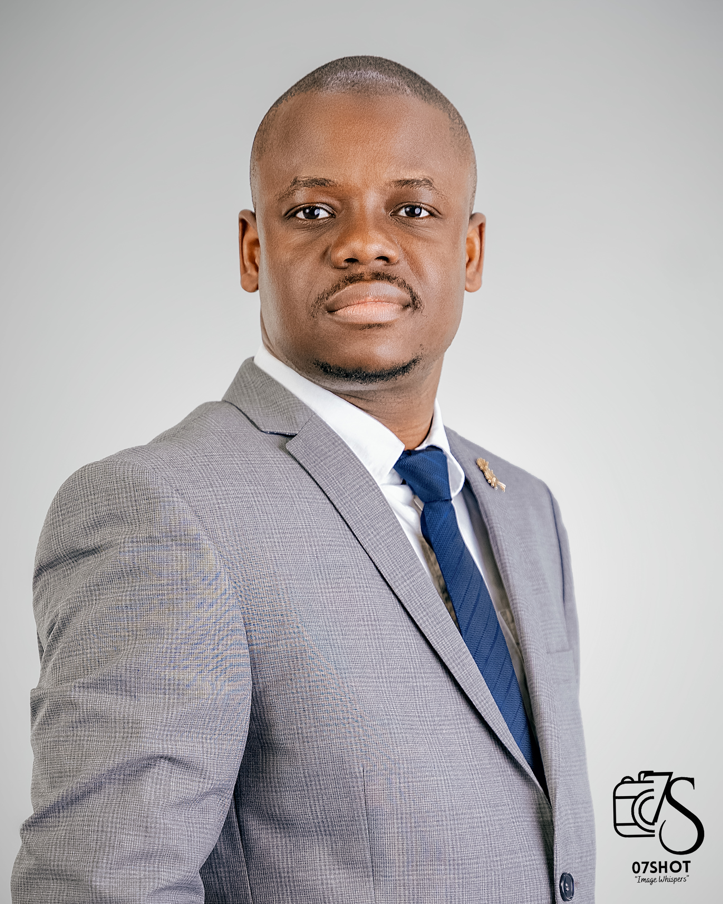
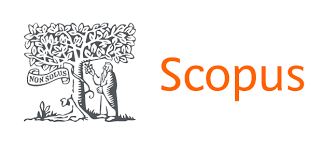

::: {layout="[25, 75]"}

::: {#profile-column}
{width=250}

<!-- Unified Single Row of Icons -->

  <a href="https://www.linkedin.com/in/abayomi-bankole-67825617a/" aria-label="LinkedIn"><i class="bi bi-linkedin"></i></a>
  <a href="https://github.com/Bankoleabayomi" aria-label="GitHub"><i class="bi bi-github"></i></a>
  <a href="https://scholar.google.com/citations?user=K2me8MsAAAAJ&hl=en" aria-label="Google Scholar"><i class="bi bi-mortarboard-fill"></i></a>
  
  
  
  

:::

::: {#about-column}
## Welcome!

I am a researcher and developer specializing in the intersection of:

* **Smart Water Treatment**
* **System Automation Modelling**
* **Computer Vision**
* **Artificial Intelligence**

My work focuses on developing robust, real-time computational tools to improve water and wastewater treatment processes, leveraging high-performance hardware and modern machine learning architectures.

## Current Focus

I am currently working on developing framework for the real-time monitoring of flocculation process and enhance the efficiency and sustainability of water treatment systems. I am also exploring the integration of AI and edge-A for . I am also exploring the integration of AI and edge-AI to enhance real-time capabilities in water and wastewater treatment systems.

## Research Overview
My research integrates **Artificial Intelligence, Computer Vision, and Process Modelling** to advance water and wastewater treatment technologies. 

*   [View Active Projects & Grants](/projects.qmd)
*   [Explore Software & Open-Source Tools](/software.qmd)

## Selected Research Projects

* **Flocculation Optimisation:** Microplastic removal research (2024–2026).
* **AI-driven Flocculation:** Sponsored by CAPES-PDSE (2025–2026).

For a full list, visit the [Projects & Grants](/projects.qmd) page.

## Recent Publications
*For my full publication record, please visit the [Publications](/publications.qmd) page.*

## Conference Presentations
*For a full list of my conference presentations, please visit the [Conference Presentations](/conference.qmd) page.*

:::